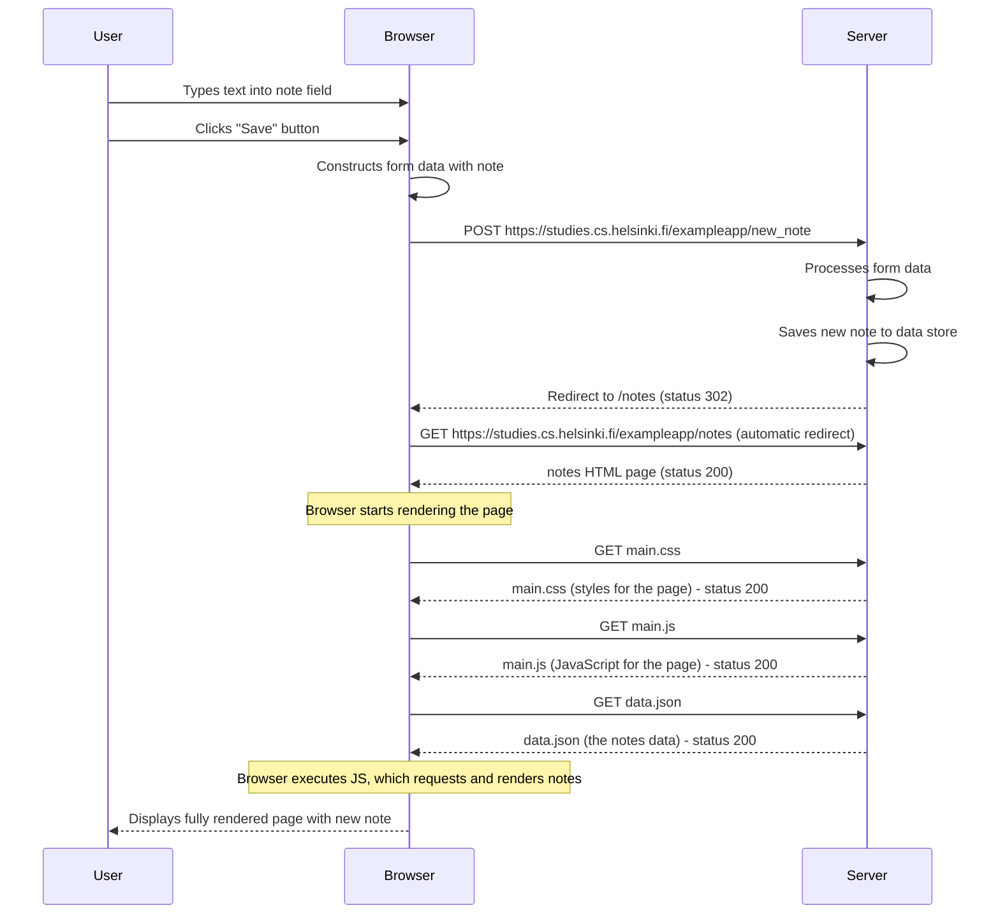

```mermaid

sequenceDiagram
    participant User
    participant Browser
    participant Server

    User->>Browser: Types text into note field
    User->>Browser: Clicks "Save" button
    Browser->>Browser: Constructs form data with note
    Browser->>Server: POST https://studies.cs.helsinki.fi/exampleapp/new_note
    Server->>Server: Processes form data
    Server->>Server: Saves new note to data store
    Server-->>Browser: Redirect to /notes (status 302)
    Browser->>Server: GET https://studies.cs.helsinki.fi/exampleapp/notes (automatic redirect)
    Server-->>Browser: notes HTML page (status 200)
    Note over Browser: Browser starts rendering the page
    Browser->>Server: GET main.css
    Server-->>Browser: main.css (styles for the page) - status 200
    Browser->>Server: GET main.js
    Server-->>Browser: main.js (JavaScript for the page) - status 200
    Browser->>Server: GET data.json
    Server-->>Browser: data.json (the notes data) - status 200
    Note over Browser: Browser executes JS, which requests and renders notes
    Browser-->>User: Displays fully rendered page with new note

```
