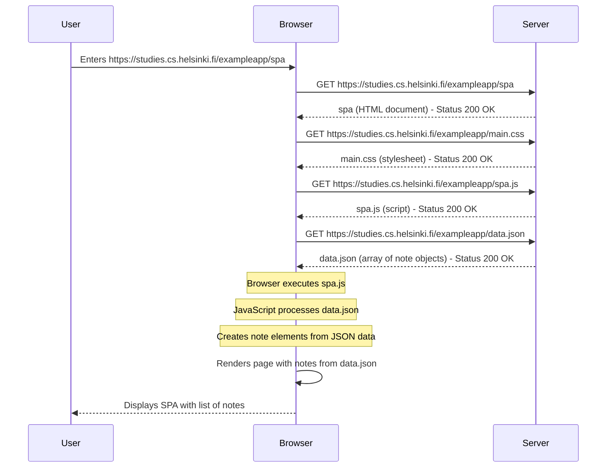

```mermaid
sequenceDiagram
    participant User
    participant Browser
    participant Server

    User->>Browser: Enters https://studies.cs.helsinki.fi/exampleapp/spa
    Browser->>Server: GET https://studies.cs.helsinki.fi/exampleapp/spa
    Server-->>Browser: spa (HTML document) - Status 200 OK
    Browser->>Server: GET https://studies.cs.helsinki.fi/exampleapp/main.css
    Server-->>Browser: main.css (stylesheet) - Status 200 OK
    Browser->>Server: GET https://studies.cs.helsinki.fi/exampleapp/spa.js
    Server-->>Browser: spa.js (script) - Status 200 OK
    Browser->>Server: GET https://studies.cs.helsinki.fi/exampleapp/data.json
    Server-->>Browser: data.json (array of note objects) - Status 200 OK
    Note over Browser: Browser executes spa.js
    Note over Browser: JavaScript processes data.json
    Note over Browser: Creates note elements from JSON data
    Browser->>Browser: Renders page with notes from data.json
    Browser-->>User: Displays SPA with list of notes
```
