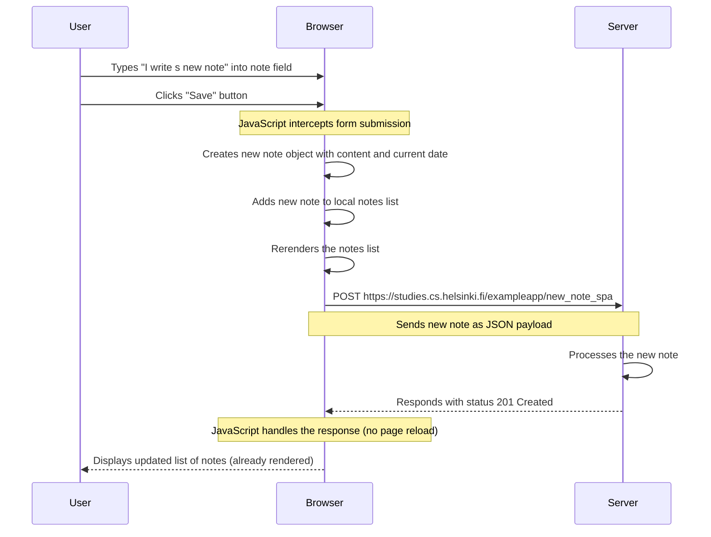

```mermaid
sequenceDiagram
    participant User
    participant Browser
    participant Server

    User->>Browser: Types "I write s new note" into note field
    User->>Browser: Clicks "Save" button
    Note over Browser: JavaScript intercepts form submission
    Browser->>Browser: Creates new note object with content and current date
    Browser->>Browser: Adds new note to local notes list
    Browser->>Browser: Rerenders the notes list
    Browser->>Server: POST https://studies.cs.helsinki.fi/exampleapp/new_note_spa
    Note over Browser,Server: Sends new note as JSON payload
    Server->>Server: Processes the new note
    Server-->>Browser: Responds with status 201 Created
    Note over Browser: JavaScript handles the response (no page reload)
    Browser-->>User: Displays updated list of notes (already rendered)
```
